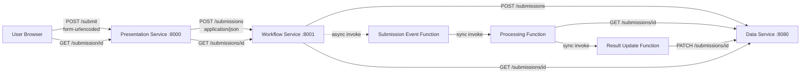
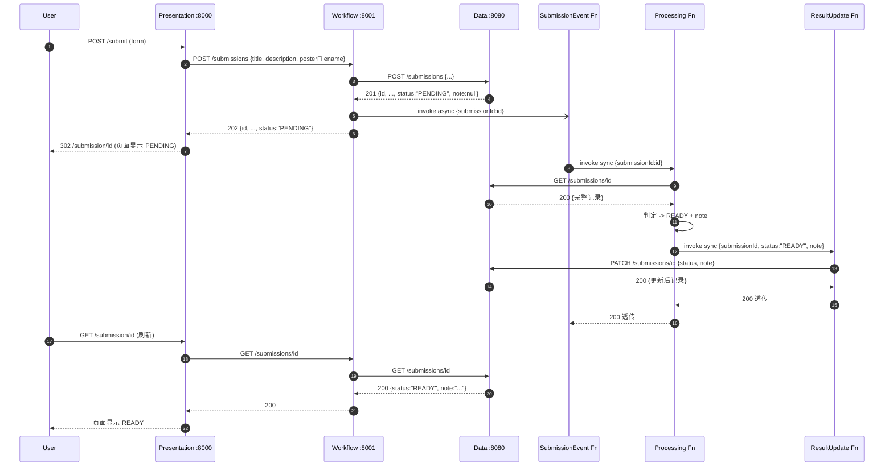

# 项目接口契约（API Contract）

> 本文件是本项目 **3 个容器化服务 + 3 个无服务器函数**之间所有接口的**单一事实来源（Single Source of Truth）**。`resource/Division of Work.md`、`C_Implementation_Guide.md`、`report/*` 以及任何实现代码（`resource/member_work/` 或后续正式实现）发生冲突时，一律以本文件为准。
>
> 本文件覆盖"所有情况"：字段命名、状态码、错误信封、幂等与重试、边界情形、幸福路径与所有失败分支。实现方可以不全部支持非必需端点（如 `/healthz`），但已列出的契约不得被单方面修改。

---

## 目录

1. [系统架构与组件](#1-系统架构与组件)
2. [全局约定](#2-全局约定)
3. [数据模型 `submission`](#3-数据模型-submission)
4. [容器 1：Presentation Service（A）](#4-容器-1presentation-servicea)
5. [容器 2：Workflow Service（B）](#5-容器-2workflow-serviceb)
6. [容器 3：Data Service（C）](#6-容器-3data-servicec)
7. [函数 1：Submission Event Function（A）](#7-函数-1submission-event-functiona)
8. [函数 2：Processing Function（B）](#8-函数-2processing-functionb)
9. [函数 3：Result Update Function（C）](#9-函数-3result-update-functionc)
10. [端到端调用链（含所有失败分支）](#10-端到端调用链含所有失败分支)
11. [幂等、重试、并发语义](#11-幂等重试并发语义)
12. [错误码全集](#12-错误码全集)
13. [可观测性要求](#13-可观测性要求)
14. [安全与部署约束](#14-安全与部署约束)
15. [契约外明确禁止的事](#15-契约外明确禁止的事)
16. [版本与变更流程](#16-版本与变更流程)
- [附录 A：最小对接清单](#附录-a最小对接清单给-a--b--c-自检)
- [附录 B：Lambda 调用信封（Invocation Envelopes）](#附录-blambda-调用信封invocation-envelopes)

---

## 1. 系统架构与组件

### 1.1 组件清单

| # | 类型 | 组件名 | Owner | 默认端口 / 入口 | 一句话定位 |
| - | - | - | - | - | - |
| 1 | Container | Presentation Service | A | `:8000` HTTP | 用户提交表单 + 查看结果页面 |
| 2 | Container | Workflow Service | B | `:8001` HTTP | 接收提交、触发事件、读回结果 |
| 3 | Container | Data Service | C | `:8080` HTTP | 唯一持久化入口（submission 记录） |
| 4 | Function | Submission Event Function | A | Lambda 事件 / Function URL | 把"新提交"事件转为一次 Processing 调用 |
| 5 | Function | Processing Function | B | Lambda 事件 / Function URL | 按题目规则算出 `status` 与 `note` |
| 6 | Function | Result Update Function | C | Lambda 事件 / Function URL | 将终态写回 Data Service |

### 1.2 调用拓扑（Mermaid）



### 1.3 "可以但不用"的调用（**允许但不作为主链**）

- Presentation Service → Data Service 直读 `GET /submissions/{id}`（作为展示页降级路径）。
- Processing Function → Function URL 形式的 Result Update Function（替代 Lambda 直调）。

**未在本节出现的跨组件调用一律禁止**（见 §15）。

---

## 2. 全局约定

### 2.1 传输与编码

- 所有 HTTP 请求/响应正文一律 `application/json; charset=utf-8`，唯一例外：Presentation Service 的表单页对浏览器接受 `application/x-www-form-urlencoded`。
- 所有字符串一律 UTF-8，禁止 ASCII-fold 或大小写归一。
- HTTP 方法必须语义正确：`GET` 只读、`POST` 创建、`PATCH` 部分更新、`PUT` 整体替换（本项目不使用）、`DELETE` 本项目不使用。

### 2.2 命名规范

- **JSON 字段**：统一 **lowerCamelCase**（`submissionId`、`posterFilename`、`createdAt`）。
- **URL 路径**：统一 **kebab-case / 单数资源名**（`/submissions/{id}`、`/healthz`）。
- **错误码**：统一 **SCREAMING_SNAKE_CASE**（`BAD_REQUEST`、`NOT_FOUND`、`INVALID_STATUS`）。
- **Lambda 函数名**：统一 **kebab-case**（`miniproj-result-update-<studentid>`）。

> 注：`resource/member_work/` 目录下的探索性实现曾使用 `snake_case`（`submission_id`、`poster_filename`）与 `/records` 路径，已废弃。正式实现与对接一律遵循本节命名。

### 2.3 时间戳

- 一律使用 ISO-8601 UTC 字符串，秒级精度，以 `Z` 结尾，例：`2026-04-18T03:12:07Z`。
- `createdAt` 仅在 Data Service `POST` 时写入；`updatedAt` 在每次 Data Service `PATCH` 时刷新。其它服务**只读**这两个字段。

### 2.4 ID 生成

- `submission.id` 仅由 **Data Service** 在 `POST /submissions` 时生成（**UUID v4** 字符串，小写）。
- 任何其它服务或函数**不得**自行生成、改写或伪造 `id`。

### 2.5 状态枚举

```
status ∈ { "PENDING", "READY", "NEEDS REVISION", "INCOMPLETE" }
```

- 注意 `"NEEDS REVISION"` 中间是**一个 ASCII 空格**，不是下划线、连字符或不可见字符。
- 初始值恒为 `"PENDING"`（Data Service 在 `POST` 时硬编码写入）。
- 终态由 Result Update Function 写回，允许覆盖 `"PENDING"`，也允许"覆盖终态"（见 §11 幂等）。

### 2.6 错误信封（统一）

所有 4xx / 5xx 响应正文：

```json
{
  "error": {
    "code": "SCREAMING_SNAKE_CASE_CODE",
    "message": "human-readable explanation"
  }
}
```

- `code` 必须来自 §12 的错误码全集。
- `message` 为英文、单行、≤ 200 字符，不得回显敏感信息（如完整堆栈、DB 路径、凭证）。

### 2.7 成功响应

- `200 OK`：读取或幂等更新成功，返回完整资源对象。
- `201 Created`：新资源创建成功，返回完整资源对象，响应头 `Location: /submissions/{id}`（可选但建议）。
- `202 Accepted`：已受理，结果仍在异步处理中（仅 Workflow Service 的 `POST /submissions` 可返回）。
- `204 No Content`：本项目**不使用**。

### 2.8 超时与连接

- 服务间 HTTP 调用**默认连接 + 读取合计 ≤ 10 秒**。
- Lambda 同步调用（RequestResponse）超时 ≤ 15 秒。
- Lambda 异步调用（Event）仅关心 `StatusCode=202`，不等待返回体。

### 2.9 CORS

- Data Service 与 Workflow Service：默认**不允许**跨域。
- Result Update Function 的 Function URL：允许 `*` 来源（演示期）。
- Presentation Service：同源，无需 CORS。

### 2.10 鉴权

- 演示期**无鉴权**（方便评审）。
- 生产场景应切换为：Function URL → `AWS_IAM`；容器 → 放在 VPC 内或增加 API Gateway + API Key。契约字段不因鉴权切换而变化。

---

## 3. 数据模型 `submission`

### 3.1 字段表

| 字段 | 类型 | 必填 | 写入方 | 说明 |
| - | - | - | - | - |
| `id` | string (UUID v4, lower-case) | 是 | Data Service | 记录唯一标识 |
| `title` | string | 是 | Presentation → Workflow → Data | 活动标题，用户输入 |
| `description` | string | 是 | Presentation → Workflow → Data | 活动简述，用户输入 |
| `posterFilename` | string | 是 | Presentation → Workflow → Data | 海报文件名（仅名字，不含路径、不含字节） |
| `status` | enum（见 §2.5） | 是 | Data Service 写 `PENDING`；Result Update 写终态 | 当前状态 |
| `note` | string \| null | 创建时为 `null`，终态必须为非空 string | Result Update Function（透传 Processing 的输出） | 用户可见的解释 |
| `createdAt` | string (ISO-8601 UTC) | 是 | Data Service | 记录创建时间 |
| `updatedAt` | string (ISO-8601 UTC) | 是 | Data Service | 记录最近一次修改时间 |

> **`details` 字段不属于契约**：`resource/member_work/` 中出现的 `details.missing_fields` / `details.revision_reasons` 为内部调试输出，不得作为正式契约字段，Data Service 可以丢弃。

### 3.2 字段校验分层

| 校验项 | 执行方 | 执行时机 | 不满足时的结果 |
| - | - | - | - |
| 三个字段均为 **字符串** 或不存在（不是数组/数字/布尔） | Data Service | `POST /submissions` 入口 | 直接 `400 BAD_REQUEST`，**不建记录** |
| JSON 能否解析 | 所有入口 | 入口 | `400 BAD_REQUEST` |
| 字段是否"缺失"（不存在、`null`、或 `strip()` 后为空串） | **Processing Function** | 判定阶段 | `status = "INCOMPLETE"` |
| 描述长度 `< 30`、或文件名不以 `.jpg/.jpeg/.png`（大小写不敏感）结尾 | **Processing Function** | 判定阶段 | `status = "NEEDS REVISION"` |

> **关键约束**：Data Service `POST` 时**不得**对"空串"做拒绝，否则 `INCOMPLETE` 的判定优先级会被破坏。Data Service 只校验"是否字符串"，不校验"是否非空"。

### 3.3 状态机

```
PENDING ─► READY
       ├─► NEEDS REVISION
       └─► INCOMPLETE

READY / NEEDS REVISION / INCOMPLETE
  ├─ 允许再次被 PATCH 覆盖为任一终态（见 §11 last-write-wins）
  └─ 禁止被 PATCH 改回 PENDING（Data Service 必须拒绝，返回 400 INVALID_STATUS_TRANSITION）
```

### 3.4 判定规则（Processing Function 专用，顺序不得调换）

1. **任一**必填字段缺失（见 §3.2）→ `INCOMPLETE`，其它规则不得覆盖。
2. 所有必填字段齐全，但 `description` 去空白后长度 `< 30` 或 `posterFilename` 不以 `.jpg/.jpeg/.png` 结尾 → `NEEDS REVISION`。
3. 否则 → `READY`。

### 3.5 `note` 文案约定（建议，不强制）

| status | 建议文案（英文，≤ 200 字符） |
| - | - |
| `READY` | `Submission passed all checks and is ready to share.` |
| `NEEDS REVISION` | 将不满足的具体理由以 `. ` 分隔串起来，如 `Description must be at least 30 characters long. Poster filename must end with .jpg, .jpeg, or .png.` |
| `INCOMPLETE` | `Missing required field(s): <逗号分隔的字段名>.` |

---

## 4. 容器 1：Presentation Service（A）

### 4.1 角色

- 只服务**浏览器**用户，不是任何服务的上游。
- 对外暴露：一个表单页、一个结果页。
- 对内调用：仅调用 Workflow Service。

### 4.2 必需端点

#### 4.2.1 `GET /`
- **用途**：返回提交表单 HTML 页面。
- **查询参数**：无。
- **响应**：`200 OK`，`text/html; charset=utf-8`。
- **表单字段**（form 控件 `name` 属性必须一致）：`title`、`description`、`posterFilename`。

#### 4.2.2 `POST /submit`
- **Content-Type**：`application/x-www-form-urlencoded`。
- **表单字段**：
  - `title`：string（未填时为空串）
  - `description`：string（同上）
  - `posterFilename`：string（同上）
- **行为**：
  1. 读取三字段，原样（保留前后空白）构造 JSON：`{"title":..., "description":..., "posterFilename":...}`。
  2. `POST` 到 `${WORKFLOW_SERVICE_URL}/submissions`。
  3. 若上游返回 `201` 或 `202`，读取 `id`，重定向到 `GET /submission/{id}`。
  4. 若上游不可达 → 返回 `502`，并在表单页显示错误提示且保留用户已填写内容。
- **失败响应**：
  - `502 Bad Gateway`（上游不可达 / 非 2xx）。
  - `400 Bad Request`：表单本身非 `application/x-www-form-urlencoded`（可选）。

#### 4.2.3 `GET /submission/{id}`
- **路径参数**：`id`（UUID v4）。
- **行为**：调用 Workflow Service 的 `GET /submissions/{id}`，把结果渲染到 HTML 页。
- **响应**：`200 OK`，`text/html; charset=utf-8`。
- **UI 要求**：
  - 显式展示 `status` 文字（与枚举一致，不翻译）。
  - 显式展示 `note`（若为 `null` 且 `status=="PENDING"`，展示为 "Processing..."）。
  - 若 `status=="PENDING"`，页面应提供"刷新"入口（可以是 meta refresh、JS 轮询或手动按钮）。
- **失败响应**：
  - 上游 `404` → 本页 `404`，显示 "Submission not found."
  - 上游不可达 → 本页 `502`。

### 4.3 可选端点

- `GET /healthz` → `200 {"ok": true}`（供外部健康检查）。

### 4.4 环境变量

| 变量 | 示例 | 说明 |
| - | - | - |
| `WORKFLOW_SERVICE_URL` | `http://workflow:8001` | Workflow 基址（不带尾 `/`） |
| `PORT` | `8000` | 监听端口 |

### 4.5 禁止事项

- **不得**直接调用 Data Service 的 `POST` / `PATCH`。
- **不得**直接调用任何 Lambda 函数。
- **不得**在页面上暴露 stack trace、DB 路径、内部 URL。

---

## 5. 容器 2：Workflow Service（B）

### 5.1 角色

- 用户提交的正式入口；同时提供"读回结果"代理（屏蔽 Data Service 的位置）。
- 仅接受来自 Presentation Service 的调用（演示期不校验，但契约上约束）。
- 向下游：Data Service（创建 / 读取）、Submission Event Function（异步触发）。

### 5.2 端点

#### 5.2.1 `POST /submissions`

- **Request Body**
  ```json
  {
    "title": "string",
    "description": "string",
    "posterFilename": "string"
  }
  ```
- **字段校验**：
  - 只校验"是字符串或不存在"；**不**校验非空。
  - 任一字段类型错误 → `400 BAD_REQUEST`，不走后续步骤。
- **行为**（按顺序）：
  1. 把 body 原样透传 `POST` 给 `${DATA_SERVICE_URL}/submissions`，拿到完整 `submission` 记录（`status=="PENDING"`, `note==null`）。
  2. 异步触发 Submission Event Function，载荷：`{"submissionId": "<新 id>"}`。
     - AWS 环境：Lambda `InvocationType=Event`；本地编排：后台线程调用 handler。
     - 触发**失败也不阻断主流程**（记录错误日志，继续返回 202）。
  3. 返回上一步拿到的完整记录。
- **成功响应**：
  - `202 Accepted`（异步处理进行中）或
  - `201 Created`（若实现者选择等待事件函数完成再返回，本项目**不推荐**）。
  - Body：完整 `submission` 对象（含 `id`、`status=="PENDING"`）。
- **失败响应**：
  - `400 BAD_REQUEST`：body 非 JSON 对象 / 字段非字符串。
  - `502 UPSTREAM_UNREACHABLE`：Data Service 不可达 / 非 2xx。
  - `500 INTERNAL`：本服务内部错误。

#### 5.2.2 `GET /submissions/{id}`

- **行为**：调用 `${DATA_SERVICE_URL}/submissions/{id}`，透传状态码与 body。
- **响应**：
  - `200 OK`：完整 `submission` 对象。
  - `404 NOT_FOUND`：id 不存在。
  - `502 UPSTREAM_UNREACHABLE`：Data Service 不可达。

#### 5.2.3 `GET /healthz`（可选）

- `200 {"ok": true, "service": "workflow"}`。

### 5.3 环境变量

| 变量 | 示例 | 说明 |
| - | - | - |
| `DATA_SERVICE_URL` | `http://data:8080` | Data Service 基址 |
| `SUBMISSION_EVENT_FUNCTION_NAME` | `miniproj-submission-event-<studentid>` | Lambda 函数名（AWS 模式） |
| `SUBMISSION_EVENT_FUNCTION_URL` | `https://xxx.lambda-url.<region>.on.aws/` | Function URL（备选） |
| `SERVERLESS_MODE` | `lambda` / `local` | 触发方式 |
| `AWS_DEFAULT_REGION` | `us-east-1` | AWS 区域 |
| `PORT` | `8001` | 监听端口 |

### 5.4 禁止事项

- **不得**在 `POST /submissions` 里执行任何业务规则判定（这是 Processing Function 的事）。
- **不得**直接调用 Processing Function / Result Update Function（必须经 Submission Event Function 链式触发）。
- **不得**直接写 Data Service（`POST` 可以，`PATCH` 不可以）。

---

## 6. 容器 3：Data Service（C）

### 6.1 角色

- 整个系统**唯一的持久化出入口**。任何其它服务、函数禁止绕过它直接访问底层存储。
- 自行管理 `id` 与时间戳，其它字段仅做"是字符串"类型校验。

### 6.2 端点

#### 6.2.1 `POST /submissions`（仅供 Workflow Service 调用）

- **Request Body**
  ```json
  { "title": "string", "description": "string", "posterFilename": "string" }
  ```
- **校验**：
  - Body 必须是 JSON 对象（否则 `400 BAD_REQUEST`）。
  - 三个字段若存在，必须是 string（否则 `400 BAD_REQUEST`）。
  - 三个字段可缺失或为空串，**一律照常建记录**（交给 Processing 判 `INCOMPLETE`）。
- **行为**：
  1. 生成 `id = uuid.uuid4()` 的小写字符串。
  2. `createdAt = updatedAt = <当前 UTC ISO-8601>`。
  3. 入库 `status="PENDING"`、`note=NULL`、三个输入字段（缺失时存空串）。
- **成功响应**：`201 Created`
  ```json
  {
    "id": "uuid",
    "title": "string",
    "description": "string",
    "posterFilename": "string",
    "status": "PENDING",
    "note": null,
    "createdAt": "2026-04-18T03:12:07Z",
    "updatedAt": "2026-04-18T03:12:07Z"
  }
  ```
- **失败响应**：`400 BAD_REQUEST`、`500 INTERNAL`。

#### 6.2.2 `GET /submissions/{id}`（任何上游可调）

- **成功响应**：`200 OK`，返回完整 `submission`（字段同 §3.1）。
- **失败响应**：
  - `404 NOT_FOUND`：id 不存在。
  - `400 BAD_REQUEST`：id 格式非法（非 UUID 可选地被拒绝，也可放任由 404）。
  - `500 INTERNAL`。

#### 6.2.3 `PATCH /submissions/{id}`（仅供 Result Update Function 调用）

- **Request Body**
  ```json
  { "status": "READY | NEEDS REVISION | INCOMPLETE", "note": "string" }
  ```
- **校验**：
  - `status` 必须是字符串且在枚举内（`PENDING` 不允许再次写入 → `400 INVALID_STATUS_TRANSITION`）。
  - `note` 必须是 string 或 `null`（Result Update 应总是传非空 string，`null` 允许但不推荐）。
- **行为**：
  1. 若 id 不存在 → `404 NOT_FOUND`。
  2. 若新 `(status, note)` 与当前记录**完全相同**（严格等值比较）→ 仍返回 `200 OK`，`updatedAt` **不刷新**。
  3. 否则更新 `status`、`note`、`updatedAt=now()`，返回更新后的完整记录。
- **成功响应**：`200 OK`，完整 `submission`。
- **失败响应**：
  - `400 BAD_REQUEST`：body 非 JSON。
  - `400 INVALID_STATUS`：status 不是字符串 / 不在枚举内。
  - `400 INVALID_STATUS_TRANSITION`：`status == "PENDING"`（禁止回退）。
  - `404 NOT_FOUND`。
  - `500 INTERNAL`。

#### 6.2.4 `GET /healthz`（必需）

- `200 {"ok": true}`。任何实现方式均可，但必须在 1 秒内返回。

### 6.3 不暴露的端点

- 本项目**不提供** `GET /submissions`（列表）、`DELETE /submissions/{id}`、`PUT /submissions/{id}`。评审不依赖这些端点。

### 6.4 存储

- 实现可选 SQLite 单文件（推荐，挂 `/data` 卷）、本地 JSON、或内存。
- 存储方案切换**不得**影响本章任何 API 字段或状态码。

### 6.5 环境变量

| 变量 | 示例 | 说明 |
| - | - | - |
| `DATA_DB_PATH` | `/data/submissions.db` | SQLite 文件路径（若用 SQLite） |
| `PORT` | `8080` | 监听端口 |

### 6.6 禁止事项

- **不得**把 `status` 从终态改回 `PENDING`。
- **不得**接受 `POST` 指定 `id`（必须服务端生成）。
- **不得**在 `POST` 时做"非空"校验（把 `INCOMPLETE` 判定权留给 Processing）。
- **不得**暴露底层 SQL 错误信息。

---

## 7. 函数 1：Submission Event Function（A）

### 7.1 角色

- 把"新提交"事件转为一次对 Processing Function 的同步调用。
- **无状态**、**无业务规则**、**不访问 Data Service**。

### 7.2 触发方式

- **Lambda Event Invoke**（由 Workflow Service `POST` 后异步触发），或
- **Function URL**（POST JSON）。

### 7.3 输入

业务载荷（Business Payload）：

```json
{ "submissionId": "uuid" }
```

本函数同时支持**两种 event 形态**（由 Lambda 运行时决定）：

- **直接 Lambda 调用**：`event` 即上面的业务载荷，原样传入。
- **Function URL 调用**：`event` 被包装成 AWS Lambda URL Payload v2（见 [附录 B](#附录-blambda-调用信封invocation-envelopes)），业务载荷位于 `event.body`（字符串，需 `json.loads`）。

实现必须能同时解析两种形态，判别式见附录 B.5。

### 7.4 输出

业务响应：

```json
{ "accepted": true, "submissionId": "uuid" }
```

两种 event 形态对应两种**返回结构**：

- **直接 Lambda 调用**：handler 返回值即业务响应对象，发送方用 `JSON.parse(response.Payload)` 直接得到。
- **Function URL 调用**：handler **必须**返回 v2 Response Envelope（`{statusCode, headers, body}`），其中 `body` 是业务响应**字符串化**后的 JSON。详见 [附录 B.3](#b3-v2-response-envelopehandler-返回---url-返回-http)。

本项目统一约定：**handler 一律返回 Response Envelope**（即使被直调也返回 envelope，发送方解包一次即可），以消除两种形态的分叉。

### 7.5 行为

1. 解析并校验 `submissionId`（必须非空字符串），否则 `400 BAD_REQUEST`。
2. 以 **RequestResponse** 方式同步调用 Processing Function；载荷：`{"submissionId": "<id>"}`。
3. 上游 2xx → 本函数返回 `{"accepted": true, "submissionId": "<id>"}`。
4. 上游非 2xx / 超时 → 返回 `502 UPSTREAM_ERROR`，**不重试**（避免重复判定）。

### 7.6 失败响应

| 错误码 | HTTP | 触发条件 |
| - | - | - |
| `BAD_REQUEST` | 400 | `submissionId` 缺失 / 非字符串 |
| `UPSTREAM_UNREACHABLE` | 502 | Processing Function 网络不可达 |
| `UPSTREAM_ERROR` | 502 | Processing Function 返回非 2xx |
| `INTERNAL` | 500 | 函数本身异常 |

### 7.7 环境变量

| 变量 | 示例 | 说明 |
| - | - | - |
| `PROCESSING_FUNCTION_NAME` | `miniproj-processing-<studentid>` | Lambda 名（AWS 模式） |
| `PROCESSING_FUNCTION_URL` | `https://xxx.lambda-url.<region>.on.aws/` | Function URL（备选） |
| `INVOKE_MODE` | `lambda` / `http` | 调用方式 |

### 7.8 禁止事项

- **不得**访问 Data Service。
- **不得**做任何 `status` / `note` 的判定或重写。
- **不得**对上游失败做指数退避重试。

---

## 8. 函数 2：Processing Function（B）

### 8.1 角色

- 业务规则**唯一**执行方；决定某 submission 的终态。
- 读 Data Service、调 Result Update Function。

### 8.2 输入

业务载荷：

```json
{ "submissionId": "uuid" }
```

event 形态（直调 vs Function URL）与解析方式同 §7.3，完整信封规范见 [附录 B](#附录-blambda-调用信封invocation-envelopes)。

### 8.3 输出

**发送给 Result Update Function 的业务载荷**（Processing 作为发送方，必须构造）：

```json
{
  "submissionId": "uuid",
  "status": "READY | NEEDS REVISION | INCOMPLETE",
  "note": "string"
}
```

发送方式两种，取决于 `INVOKE_MODE`：

- `lambda`：`boto3.client("lambda").invoke(FunctionName=..., InvocationType="RequestResponse", Payload=json.dumps(上面的业务载荷))`。
- `http`：`POST ${RESULT_UPDATE_FUNCTION_URL}` with `Content-Type: application/json`，body 为业务载荷的 JSON 字符串。

**消费 Result Update 返回**：两种形态下都得到 v2 Response Envelope（见 [附录 B.4](#b4-发送方如何消费解析-v2-response)），解包出 `statusCode` / `body`，再 `json.loads(body)` 得到 Data Service 的完整 `submission`。

**Processing 自身的返回**：本函数同样**必须返回 v2 Response Envelope**。`statusCode` 透传 Result Update 的 `statusCode`；`body` 透传 Result Update 的 `body` 字符串（即 Data Service 的 `submission` 对象 JSON）。

### 8.4 行为（按顺序，不得调换）

1. 校验 `submissionId`（非空字符串），否则 `400 BAD_REQUEST`。
2. `GET ${DATA_SERVICE_URL}/submissions/{submissionId}`。
   - 404 → 本函数返回 `404 NOT_FOUND`（不要再调 Result Update）。
   - 非 2xx → `502 UPSTREAM_ERROR`。
3. 执行 §3.4 的三条判定规则（**顺序不得调换**）：
   - 缺失任一字段 → `status="INCOMPLETE"`，`note="Missing required field(s): <names>."`
   - 描述 `< 30` 或扩展名不合法 → `status="NEEDS REVISION"`，`note=` 按 §3.5 拼接。
   - 否则 → `status="READY"`，`note="Submission passed all checks and is ready to share."`
4. 调用 Result Update Function（同步 RequestResponse），载荷：`{"submissionId":"...", "status":"...", "note":"..."}`。
5. 返回 Result Update 的响应（透传 statusCode 与 body）。

### 8.5 判定边界情形（**必须覆盖**）

| 输入 | 结果 |
| - | - |
| `title` 为 `null` | `INCOMPLETE` |
| `title` 为 `"   "`（全空白） | `INCOMPLETE`（strip 后为空串） |
| `description` 为 `"exactly 29 chars ....."`（去空白后 `< 30`） | `NEEDS REVISION`（字段齐全但描述太短） |
| `description` 为 `"exactly thirty chars ........."`（去空白后 `== 30`） | `READY` 或 `NEEDS REVISION` 取决于别的规则 |
| `posterFilename == "poster.JPG"` | 扩展名合法（大小写不敏感） |
| `posterFilename == "poster.jpg.bak"` | `NEEDS REVISION`（不以允许扩展名结尾） |
| `posterFilename == "poster"` | `NEEDS REVISION` |
| 所有字段都齐 + 描述 `< 30` + 扩展名错 | `NEEDS REVISION`，`note` 必须**同时**包含两条理由 |
| 所有字段都齐 + 描述 `>= 30` + 扩展名合法 | `READY` |
| `title` 缺失 + 描述 `< 30` + 扩展名错 | `INCOMPLETE`（缺失优先，`note` 不混入 revision 理由） |

### 8.6 失败响应

| 错误码 | HTTP | 触发条件 |
| - | - | - |
| `BAD_REQUEST` | 400 | `submissionId` 非法 |
| `NOT_FOUND` | 404 | Data Service 找不到该 id |
| `UPSTREAM_UNREACHABLE` | 502 | Data Service / Result Update 不可达 |
| `UPSTREAM_ERROR` | 502 | Data Service / Result Update 返回非 2xx |
| `INTERNAL` | 500 | 函数本身异常 |

### 8.7 环境变量

| 变量 | 示例 | 说明 |
| - | - | - |
| `DATA_SERVICE_URL` | `http://<EC2-IP>:8080` | Data Service 基址 |
| `RESULT_UPDATE_FUNCTION_NAME` | `miniproj-result-update-<studentid>` | Lambda 名 |
| `RESULT_UPDATE_FUNCTION_URL` | `https://xxx.lambda-url.<region>.on.aws/` | Function URL（备选） |
| `INVOKE_MODE` | `lambda` / `http` | 调用方式 |
| `PROCESSING_DELAY_SECONDS` | `0` | 人为延迟（仅演示用） |

### 8.8 禁止事项

- **不得**直接 `PATCH` Data Service（必须通过 Result Update Function）。
- **不得**修改 `id`、`createdAt`、`updatedAt`、`title`、`description`、`posterFilename`。
- **不得**缓存 submission 记录跨事件复用（状态可能已被其它终态覆盖）。

---

## 9. 函数 3：Result Update Function（C）

### 9.1 角色

- 纯转发器：把 Processing 的 `(status, note)` 写回 Data Service。
- **无任何业务规则**。

### 9.2 输入

业务载荷：

```json
{ "submissionId": "uuid", "status": "READY | NEEDS REVISION | INCOMPLETE", "note": "string" }
```

event 形态（直调 vs Function URL）与解析方式同 §7.3，完整信封规范见 [附录 B](#附录-blambda-调用信封invocation-envelopes)。

### 9.3 输出

本函数**必须返回 v2 Response Envelope**（见 [附录 B.3](#b3-v2-response-envelopehandler-返回---url-返回-http)）：

- 成功（Data Service `PATCH` 返回 `200`）：`{statusCode:200, headers:{"Content-Type":"application/json"}, body:"<Data Service 200 body 字符串>"}`，`body` 里是完整 `submission` 对象（§3.1）。
- 失败：`statusCode` 透传自 Data Service（`400` / `404`）或 `502`（网络错误），`body` 为错误信封（§2.6）的字符串化 JSON。

### 9.4 行为

1. 解析 event（直调 / URL 两种形态）。
2. 校验：
   - `submissionId`：非空字符串 → 否则 `400 BAD_REQUEST`。
   - `status`：必须 `∈ {"READY", "NEEDS REVISION", "INCOMPLETE"}`（**不包含 `PENDING`**）→ 否则 `400 INVALID_STATUS`。
   - `note`：string 或 `null` → 否则 `400 BAD_REQUEST`。
3. `PATCH ${DATA_SERVICE_URL}/submissions/{submissionId}`，body 为 `{"status": status, "note": note}`。
4. 透传 Data Service 的响应（包括状态码）。
5. 网络错误 → `502 UPSTREAM_UNREACHABLE`。

### 9.5 日志要求

- 进入时打印一行：`PATCH <url> payload: <json>`。
- 成功时打印：`DATA_SERVICE_OK <status>`。
- 失败时打印：`DATA_SERVICE_HTTPERROR <code> <detail>` 或 `DATA_SERVICE_UNREACHABLE <error>`。

### 9.6 失败响应

| 错误码 | HTTP | 触发条件 |
| - | - | - |
| `BAD_REQUEST` | 400 | `submissionId` / `note` 非法 |
| `INVALID_STATUS` | 400 | `status` 不在 `{READY, NEEDS REVISION, INCOMPLETE}` |
| `NOT_FOUND` | 404 | Data Service 返回 404 |
| `UPSTREAM_UNREACHABLE` | 502 | 网络不可达 |
| `UPSTREAM_ERROR` | 502 | Data Service 其它非 2xx |
| `INTERNAL` | 500 | 函数自身异常 |

### 9.7 环境变量

| 变量 | 示例 | 说明 |
| - | - | - |
| `DATA_SERVICE_URL` | `http://<EC2-IP>:8080` | Data Service 基址 |

### 9.8 禁止事项

- **不得**执行 §3.4 的规则判定（即使输入看起来像错的）。
- **不得**写 `status="PENDING"`（参数校验阶段就要拒绝）。
- **不得**自行重试（交由调用方处理）。

---

## 10. 端到端调用链（含所有失败分支）

### 10.1 Happy Path（READY）



### 10.2 失败分支矩阵

| 失败点 | 表现 | 系统响应 | 用户看到 |
| - | - | - | - |
| Workflow `POST /submissions`：body 非 JSON | `400 BAD_REQUEST` | Presentation 返回 `400`，表单页提示 | "Invalid submission, please retry." |
| Data Service 不可达（创建阶段） | `502 UPSTREAM_UNREACHABLE` | Presentation 返回 `502` | "Workflow service is unavailable." |
| Submission Event Function 触发失败 | Workflow 记录错误，仍返回 `202` | 用户最终卡在 `PENDING` | Presentation 页面轮询看到 `PENDING`，10 秒后可显示 "Processing takes longer than expected." |
| Processing Function 读 Data 返回 404 | Processing 返回 `404`，不调 Result Update | 记录保持 `PENDING` | 同上 |
| Processing Function 判定完成，调 Result Update 超时 | Processing 返回 `502`；记录可能仍是 `PENDING` | 用户卡在 `PENDING` | 同上 |
| Result Update 收到非法 `status` | `400 INVALID_STATUS` | Processing 返回 `502` | 同上 |
| Data Service `PATCH` 目标 id 不存在 | Result Update 返回 `404` | Processing 返回 `404` | 用户卡在 `PENDING`（异常情况） |
| 用户提交时所有字段为空 | `POST /submissions` 仍返回 `201`（`status:"PENDING"`）→ Processing 判 `INCOMPLETE` | 用户刷新后看到 `INCOMPLETE` | 页面显示 `INCOMPLETE` + `note` |
| 描述 29 字符 + `.png` | Processing 判 `NEEDS REVISION`（仅 description 理由） | 正常落库 | `NEEDS REVISION` |
| 描述 100 字符 + `poster.gif` | Processing 判 `NEEDS REVISION`（仅 extension 理由） | 正常落库 | `NEEDS REVISION` |
| `title=null` + 描述 20 字符 + `poster.gif` | Processing 判 `INCOMPLETE`（缺失优先，note 不合并） | 正常落库 | `INCOMPLETE` |

---

## 11. 幂等、重试、并发语义

### 11.1 `PATCH /submissions/{id}`

- **严格幂等**：对同一 `id` 反复 PATCH **相同**的 `(status, note)`，必须返回 `200`，**且 `updatedAt` 不刷新**。
- **Last-Write-Wins**：同一 `id` 的不同 `(status, note)` 以**最后一次写入为准**，`updatedAt` 刷新。`status` 可以从 `READY` 被覆盖为 `INCOMPLETE`（允许 Processing 重判），但**不得**被改回 `PENDING`。
- **并发**：Data Service 必须对单条记录的 UPDATE 使用事务或行锁；不允许出现"读-改-写"竞态。

### 11.2 Submission Event / Processing 的"at-most-once"

- 事件函数链（Submission Event → Processing → Result Update）设计为 **at-most-once**：任何一层非 2xx 都直接失败返回，**禁止自动重试**，避免重复判定导致的状态抖动。
- 若出现重复触发（例如网络重试或 AWS Lambda 异步重试策略），所有终态都会再次经过 Data Service `PATCH`，幂等语义保证系统稳定。

### 11.3 Workflow `POST /submissions`

- **非幂等**：同一请求重发会创建两条不同 `id` 的记录。客户端应避免重发（Presentation 页面提交后立即重定向即可）。

### 11.4 GET 端点

- 所有 `GET` 严格只读，不产生任何副作用（不触发事件、不更新时间戳）。

---

## 12. 错误码全集

| 错误码 | HTTP | 出现组件 | 语义 |
| - | - | - | - |
| `BAD_REQUEST` | 400 | 所有 | 请求格式或字段类型错误 |
| `INVALID_STATUS` | 400 | Data Service, Result Update | `status` 不在枚举内 |
| `INVALID_STATUS_TRANSITION` | 400 | Data Service | 试图把终态改回 `PENDING` |
| `NOT_FOUND` | 404 | Data Service, Workflow, Presentation | 资源不存在 |
| `METHOD_NOT_ALLOWED` | 405 | 所有 | 使用未在本文档声明的方法 |
| `UPSTREAM_UNREACHABLE` | 502 | Workflow, Submission Event, Processing, Result Update | 下游网络不可达或解析失败 |
| `UPSTREAM_ERROR` | 502 | Workflow, Submission Event, Processing, Result Update | 下游返回非 2xx |
| `INTERNAL` | 500 | 所有 | 组件自身异常 |
| `TIMEOUT` | 504 | Workflow, 所有函数 | 下游超时（可选，≥10s 未响应） |

> 禁止引入本表之外的新错误码；确需新增需经过 §16 的变更流程。

---

## 13. 可观测性要求

### 13.1 必需日志字段

每个组件每处理一次请求至少打一行结构化或半结构化日志，必须包含：

- 组件名（`data-service` / `workflow` / `processing` / ...）
- 请求方法 + 路径 + `submissionId`（若存在）
- 响应 statusCode
- 开始 / 结束时间或耗时 ms

### 13.2 关键日志标记（用于评审抓取）

| 组件 | 关键关键字 | 出现时机 |
| - | - | - |
| Data Service | `HTTP 201 /submissions` | 创建成功 |
| Data Service | `HTTP 200 /submissions/{id} PATCH` | 更新成功 |
| Workflow | `TRIGGERED submission-event` | 异步触发成功 |
| Submission Event Fn | `INVOKED processing` | 同步调用 |
| Processing Fn | `VERDICT status=<X> note=<Y>` | 判定完成 |
| Result Update Fn | `DATA_SERVICE_OK 200` | 写回成功 |

### 13.3 CloudWatch / 容器日志

- Lambda：CloudWatch Logs 一个 Log Group 一个函数。
- 容器：`stdout` 即可，容器编排器负责收集。

---

## 14. 安全与部署约束

### 14.1 网络

- Data Service：仅在 `:8080` 暴露；安全组最小放行：Lambda 出口 NAT 段 + 本地笔记本 IP。
- Workflow / Presentation：`:8001` / `:8000` 可公网（演示）。
- Result Update Function URL：`AUTH_TYPE=NONE`（演示），CORS `*`。

### 14.2 IAM

- Lambda Execution Role 仅允许 `logs:CreateLogGroup`、`logs:CreateLogStream`、`logs:PutLogEvents` 三个 Action；禁止 `s3:*`、`ec2:*`、`lambda:InvokeFunction`（除非确需跨 Lambda 调用）。

### 14.3 秘密

- 本项目**不**使用 DB 密码、API Key、签名密钥；若需引入，必须走 AWS Secrets Manager 或 Lambda 环境变量加密，禁止硬编码。

### 14.4 数据持久化

- Data Service 所有状态写 `/data` 卷（容器内绑定持久化路径）；容器重启不得丢失已入库记录。
- Lambda 全部**无状态**：不得写本地文件系统（`/tmp` 除外，且不得跨调用依赖）。

---

## 15. 契约外明确禁止的事

1. **禁止**任何服务或函数绕过 Data Service 直接读写底层存储（SQLite 文件、JSON 文件等）。
2. **禁止** Presentation / Workflow 直接调用 Processing Function 或 Result Update Function；必须经 Submission Event Function 串起来。
3. **禁止** Processing Function 直接 `PATCH` Data Service；所有写入必须走 Result Update Function。
4. **禁止**任何组件自行生成 `submission.id`、改写 `createdAt` / `updatedAt`。
5. **禁止** Result Update Function 写 `status="PENDING"`。
6. **禁止** Data Service 在 `POST` 时做"字段非空"校验（`INCOMPLETE` 优先级会被破坏）。
7. **禁止**使用本文档之外的字段名（特别是 `snake_case`、`submission_id`、`poster_filename`）参与跨组件通信；内部实现可使用，但跨边界一律转换为 lowerCamelCase。
8. **禁止**在终态之间"循环"覆写作为重试机制；重试一律由上游重新发起完整链路。
9. **禁止**在错误信封外暴露 stack trace / SQL / 文件路径。
10. **禁止**在评审期修改本文件而不同步通知所有三名成员。

---

## 16. 版本与变更流程

- **当前版本**：`v1.0.0`（2026-04-18）。
- **兼容原则**：同一主版本内只允许**新增可选字段**或**新增可选端点**；已有字段的语义、类型、状态码、路径一律冻结。
- **破坏性变更**：必须提升主版本号，并至少获得 **三人书面同意**（邮件 / PR Review / 会议纪要任选其一）。
- **变更落地顺序**：
  1. 在本文件中先落笔（PR Review 通过）。
  2. 再同步到 `resource/Division of Work.md` 的摘要表。
  3. 最后各组件实现跟进；跨文件口径不一致时，本文件优先。

---

## 附录 A：最小对接清单（给 A / B / C 自检）

- [ ] Presentation 的表单 `name` 属性与 JSON 字段名一一对应（`title` / `description` / `posterFilename`）。
- [ ] Workflow `POST /submissions` 成功后立即返回，不等 Processing。
- [ ] Data Service `POST` 不对空串做拒绝。
- [ ] Data Service `PATCH` 对相同 `(status, note)` 连调两次都返回 `200`、`updatedAt` 不变。
- [ ] Data Service `PATCH` 拒绝 `status="PENDING"`。
- [ ] Submission Event Function 既能处理"直调 event"也能处理"Function URL event"。
- [ ] Processing Function 的规则顺序严格按 §3.4。
- [ ] Result Update Function 不做任何规则判定。
- [ ] 所有错误响应遵循 §2.6 错误信封。
- [ ] 所有时间戳为 ISO-8601 UTC（带 `Z`）。
- [ ] 所有 `id` 为小写 UUID v4。
- [ ] 所有 Lambda handler 返回符合附录 B.3 的 Response Envelope（`statusCode` + `headers` + `body` 字符串）。

---

## 附录 B：Lambda 调用信封（Invocation Envelopes）

> AWS Lambda Function URL 使用 **payload format version 2.0** 作为 HTTP ↔ event 的双向封装。本附录锁定所有三个函数（Submission Event / Processing / Result Update）**必须遵守**的事件信封（Request Event）与响应信封（Response Envelope）结构，以及发送方如何构造请求、解析响应。
>
> 外部权威规范：<https://docs.aws.amazon.com/lambda/latest/dg/urls-invocation.html#urls-payloads>。本附录对其做**子集化 + 项目化约定**，AWS 未来新增字段一律按"可忽略"处理，除非本附录明确提升为必需。

### B.1 两种调用方式的对照

| 维度 | 直接 Lambda 调用（boto3 / 控制台 Test / 另一 Lambda 内部调） | Function URL（HTTPS POST） |
| - | - | - |
| 入参 `event` 结构 | 发送方传入的 `Payload` JSON 原样（即业务载荷） | 被包成 B.2 的 v2 Request Event，业务载荷在 `event.body`（字符串） |
| handler 返回值 | 本项目要求返回 B.3 的 Response Envelope | 必须返回 B.3 的 Response Envelope |
| HTTP 状态码映射 | 由 handler 返回值的 `statusCode` 字段传递（发送方读取它作为业务状态码） | Lambda URL 将 `statusCode` 映射为实际 HTTP 状态码 |
| 发送方如何发 | `boto3.client("lambda").invoke(InvocationType="RequestResponse"/"Event", Payload=json.dumps(业务载荷))` | 普通 HTTPS 客户端 `POST <FUNCTION_URL>` + `Content-Type: application/json` + body 为业务载荷 JSON 字符串 |
| 发送方如何收 | `response.Payload.read()` → 字符串 → `json.loads(...)` → Response Envelope 对象 | 普通 HTTP 响应：`r.status_code` 即业务 `statusCode`；`r.text` / `r.json()` 得到 `body` |
| 适用于项目内哪次调用 | Workflow → Submission Event（`Event` 异步）；Submission Event → Processing（`RequestResponse`）；Processing → Result Update（`RequestResponse`） | 外部 curl / 评审演示；也作为上面三次调用的**备选**形态（由 `INVOKE_MODE` 切换） |

> 本项目要求：无论哪种调用方式，handler 都**统一返回 Response Envelope**。好处：(a) 两种形态的发送方代码路径相同（都是"解 envelope"）；(b) 日志 / 调试输出一致；(c) 从直调迁移到 URL 时无需修改 handler。

### B.2 v2 Request Event（Lambda URL → handler）

当 Lambda 通过 Function URL 被触发时，运行时注入给 handler 的 `event` 对象完整结构如下（下示展示所有**可能出现**的字段；未列出的字段一律视为 AWS 保留字段，本项目**不得**读取）：

```json
{
  "version": "2.0",
  "routeKey": "$default",
  "rawPath": "/",
  "rawQueryString": "",
  "cookies": ["name=value"],
  "headers": {
    "content-type": "application/json",
    "content-length": "42",
    "host": "abcdefg.lambda-url.us-east-1.on.aws",
    "user-agent": "curl/8.0.1",
    "x-amzn-trace-id": "Root=1-xxxx",
    "x-forwarded-for": "203.0.113.42",
    "x-forwarded-port": "443",
    "x-forwarded-proto": "https"
  },
  "queryStringParameters": { "key": "value" },
  "requestContext": {
    "accountId": "anonymous",
    "apiId": "abcdefg",
    "authentication": null,
    "authorizer": { "iam": { ... } },
    "domainName": "abcdefg.lambda-url.us-east-1.on.aws",
    "domainPrefix": "abcdefg",
    "http": {
      "method": "POST",
      "path": "/",
      "protocol": "HTTP/1.1",
      "sourceIp": "203.0.113.42",
      "userAgent": "curl/8.0.1"
    },
    "requestId": "xxxxxxxx-xxxx-xxxx-xxxx-xxxxxxxxxxxx",
    "routeKey": "$default",
    "stage": "$default",
    "time": "18/Apr/2026:03:12:07 +0000",
    "timeEpoch": 1744942327000
  },
  "body": "{\"submissionId\":\"b8f0c0c6-2c2e-4d6f-a3e1-9a7c9a0b4a6f\"}",
  "pathParameters": null,
  "stageVariables": null,
  "isBase64Encoded": false
}
```

#### B.2.1 必读字段（唯一）

| 字段 | 类型 | 用途 |
| - | - | - |
| `body` | string | 业务载荷 JSON 的字符串形式，需 `json.loads` 解析。**可能为空字符串**，此时视为 `400 BAD_REQUEST`。 |

#### B.2.2 可读但非必读

| 字段 | 典型用途 | 本项目是否使用 |
| - | - | - |
| `headers["content-type"]` | 校验是否 JSON | 否（我们**只**接受 JSON，直接 `json.loads` 失败就 `400`） |
| `requestContext.http.method` | 区分 GET / POST | 否（本项目函数仅接受 POST，其它方法由 Lambda URL 自动返回 405 前我们不处理） |
| `requestContext.requestId` | 日志链路 | 建议打日志（非强制） |
| `isBase64Encoded` | 二进制 body | 本项目一律 `false`；若收到 `true`，视为 `400 BAD_REQUEST` |

#### B.2.3 禁止读取

所有未在 B.2.1 / B.2.2 列出的字段，**禁止**作为业务逻辑输入（不保证 AWS 在同一 payload 版本内兼容性）。

### B.3 v2 Response Envelope（handler 返回 → URL 返回 HTTP）

handler 必须返回以下结构；Lambda URL 会把它转成 HTTP 响应给远端调用方：

```json
{
  "statusCode": 200,
  "headers": {
    "Content-Type": "application/json"
  },
  "body": "{\"submissionId\":\"b8f0c0c6-...\",\"status\":\"READY\",\"note\":\"...\"}",
  "isBase64Encoded": false,
  "cookies": []
}
```

#### B.3.1 必需字段

| 字段 | 类型 | 约束 |
| - | - | - |
| `statusCode` | integer | 必须 `∈ {200, 201, 202, 400, 404, 500, 502, 504}`，语义同 §12 错误码全集 |
| `body` | string | 业务响应 JSON 的**字符串**形式（即 `json.dumps(...)` 的结果）；**不得**是对象 |

#### B.3.2 建议字段

| 字段 | 建议值 | 说明 |
| - | - | - |
| `headers` | `{"Content-Type": "application/json"}` | Lambda URL 若不给会自动补 `application/json`，但显式写更稳 |
| `isBase64Encoded` | `false` | 本项目永不使用二进制响应 |

#### B.3.3 禁止使用

- `cookies`：本项目不用 cookie（演示期无鉴权，后续若启用 IAM 也走 SigV4 header 而非 cookie）。
- `multiValueHeaders`：v2 已不支持，禁止使用。
- 返回"裸对象"（例如 `return {"submissionId": "..."}`）：虽然 Lambda URL 会自动用 200 包装，但会丢失错误状态码语义，**本项目强制** handler 返回完整 envelope。

#### B.3.4 错误响应示例

```json
{
  "statusCode": 400,
  "headers": { "Content-Type": "application/json" },
  "body": "{\"error\":{\"code\":\"INVALID_STATUS\",\"message\":\"status must be READY / NEEDS REVISION / INCOMPLETE\"}}"
}
```

### B.4 发送方如何消费（解析 v2 Response）

#### B.4.1 通过 Function URL（HTTPS POST）

发送方收到的是**普通 HTTP 响应**，Lambda URL 已经把 envelope 解成了 HTTP 语义：

- HTTP 响应状态码 = envelope.`statusCode`
- HTTP 响应 body（字符串） = envelope.`body`（已是业务响应的 JSON 字符串，直接 `JSON.parse` / `response.json()` 得到业务对象）
- HTTP 响应 headers = envelope.`headers` ∪ Lambda URL 注入的若干默认 header

发送方代码（Python 标准库示例）：

```python
import json, urllib.request, urllib.error

payload = {"submissionId": sid, "status": "READY", "note": "..."}
req = urllib.request.Request(
    FUNCTION_URL,
    data=json.dumps(payload).encode("utf-8"),
    method="POST",
    headers={"Content-Type": "application/json"},
)
try:
    with urllib.request.urlopen(req, timeout=10) as r:
        business = json.loads(r.read().decode("utf-8"))
        status = r.status
except urllib.error.HTTPError as e:
    detail = e.read().decode("utf-8", errors="ignore")
    status = e.code
    business = json.loads(detail) if detail else {}
```

#### B.4.2 通过直调（boto3 `lambda.invoke`）

发送方拿到 `response["Payload"].read()`（bytes），它是 handler 返回值的字符串化 JSON（**整个 envelope**，不是 envelope 里的 `body`）。因此需要**解两层**：

```python
import json, boto3

client = boto3.client("lambda")
resp = client.invoke(
    FunctionName=RESULT_UPDATE_FUNCTION_NAME,
    InvocationType="RequestResponse",
    Payload=json.dumps({"submissionId": sid, "status": "READY", "note": "..."}).encode("utf-8"),
)
envelope = json.loads(resp["Payload"].read().decode("utf-8"))
status = envelope["statusCode"]
business = json.loads(envelope["body"]) if envelope.get("body") else {}
```

#### B.4.3 异步直调（`InvocationType="Event"`）

Workflow → Submission Event 使用此形态。发送方**只关心 `response["StatusCode"] == 202`**（AWS 已接受事件），**不**读 `Payload`（异步调用没有返回值）。Submission Event handler 的 `statusCode` 在这条链上**被丢弃**，不影响 Workflow 的 `POST /submissions` 主流程。

### B.5 双形态适配模板（所有函数必须使用）

项目级强制：三个函数 handler 的入口与出口必须遵循以下两段模板。

#### B.5.1 入口：event → 业务载荷

```python
def _parse_event(event):
    if isinstance(event, dict) and isinstance(event.get("body"), str):
        try:
            return json.loads(event["body"])
        except json.JSONDecodeError:
            return None
    if isinstance(event, dict):
        return event
    return None
```

- 返回 `None` 时统一响应 `400 BAD_REQUEST`。
- 判别式：**仅**基于 `isinstance(event["body"], str)`。因为直调场景下，即使业务载荷里碰巧也有 `body` 键，它的值也绝不会是"包着业务 JSON 的字符串"形态（本契约禁止业务字段叫 `body`）。

#### B.5.2 出口：业务响应 → Response Envelope

```python
def _envelope(status_code: int, business: dict) -> dict:
    return {
        "statusCode": status_code,
        "headers": {"Content-Type": "application/json"},
        "body": json.dumps(business),
    }
```

所有 `return` 路径一律 `return _envelope(...)`；禁止裸 `return business_dict`。

#### B.5.3 综合骨架

```python
def lambda_handler(event, context):
    payload = _parse_event(event)
    if payload is None:
        return _envelope(400, {"error": {"code": "BAD_REQUEST", "message": "invalid json body"}})

    try:
        result = _do_work(payload)
        return _envelope(200, result)
    except ValidationError as ve:
        return _envelope(400, {"error": {"code": ve.code, "message": ve.message}})
    except UpstreamError as ue:
        return _envelope(ue.status or 502, {"error": {"code": "UPSTREAM_ERROR", "message": str(ue)}})
    except Exception as ex:
        return _envelope(500, {"error": {"code": "INTERNAL", "message": "unexpected error"}})
```

### B.6 兼容性与版本

- 本附录锁定 **AWS Lambda Function URL payload format version 2.0**（即 `event.version == "2.0"`）。
- 若 AWS 日后发布 `version == "3.0"`，必须通过 §16 的破坏性变更流程重审本附录后再升级。
- 不支持 v1.0 格式（`resource` / `httpMethod` / `path` 顶层字段那套），任何带 `version != "2.0"` 的 event 应被视为配置错误，直接返回 `500 INTERNAL`。
