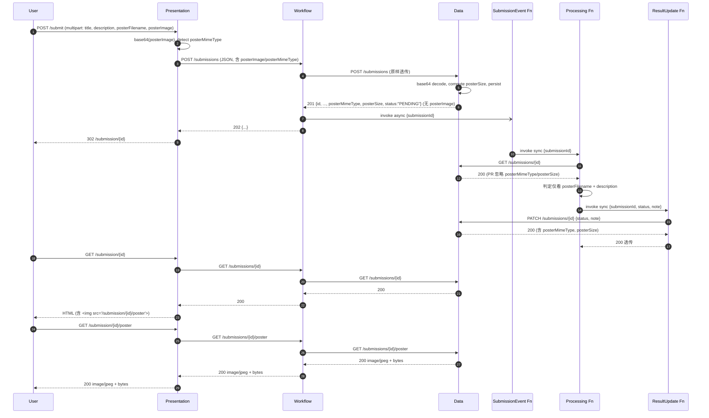

# 项目接口契约 · 附加卷（API Contract Append）

> 本文件是 `API_CONTRACT.md` 的附加卷，处理"除海报文件名外还要上传海报图片字节"的需求。本文件遵循 `API_CONTRACT.md` §16 的版本与变更流程，是一次向后兼容的小版本演进（`v1.0.0 → v1.1.0`）：只新增可选字段 / 可选端点 / 可选错误码分支。
>
> 当本文件与 `API_CONTRACT.md` 发生冲突时：本文件**明确覆盖**的条款以本文件为准；未覆盖的回落到 `API_CONTRACT.md`。
>
> 本文件只规定**接口定义与行为**。实现选型（框架、环境变量命名、部署配置、迁移脚本、测试脚本）不属于契约，由各实现方自行决定。

---

## 目录

- [0. 元数据](#0-元数据)
- [1. 范围](#1-范围)
- [2. 版本与兼容性](#2-版本与兼容性)
- [3. 数据模型增量](#3-数据模型增量)
- [4. 判定规则（锁死 §3.4）](#4-判定规则锁死-34)
- [5. Presentation Service](#5-presentation-service)
- [6. Workflow Service](#6-workflow-service)
- [7. Data Service](#7-data-service)
- [8. Lambda 函数（零改动）](#8-lambda-函数零改动)
- [9. 端到端调用链](#9-端到端调用链)
- [10. 新增错误码](#10-新增错误码)
- [11. 幂等、重试、并发](#11-幂等重试并发)
- [12. 契约外明确禁止](#12-契约外明确禁止)
- [13. 边界矩阵](#13-边界矩阵)
- [14. 验证方式](#14-验证方式)
- [版本历史](#版本历史)

---

## 0. 元数据

| 项 | 值 |
| - | - |
| 基版本 | `API_CONTRACT.md` **v1.0.0** |
| 本附加卷 | **v1.1.0**（2026-04-20） |
| 兼容类型 | 向后兼容（minor，非破坏性） |
| 作用范围 | 新增"海报图片字节"字段、上传路径、回读路径；不触碰已有字段与判定规则 |

> **编号约定**：本附加卷沿用基版本章节号。引用基版本写 `基版本 §N` 或 `基版本 §N 第 K 条`；引用本附加卷自有章节在可能与基版本同号冲突时（§3 / §5 / §6 / §7 / §10 / §11 / §12 / §15 两侧都有）显式加 `§Append-` 前缀，如 `§Append-11.1`、`§Append-12 第 13 条`。

---

## 1. 范围

### 1.1 新增

- 数据字段：`posterImage` / `posterMimeType` / `posterSize`（见 §Append-3）。
- 端点：`GET /submissions/{id}/poster`（Data Service 必须实现；Workflow / Presentation 可作为代理）。
- 请求内容类型：Presentation `POST /submit` 允许 `multipart/form-data`（旧 `application/x-www-form-urlencoded` 仍合法）。
- 错误码：`PAYLOAD_TOO_LARGE`（HTTP 413）。

### 1.2 不改

- 基版本 §2 全局约定（字段命名、时间格式、UUID、错误信封）。
- 基版本 §3.3 状态机、§3.4 判定规则、§3.5 note 文案。
- 基版本 §7 / §8 / §9 三个 Lambda 函数的输入、输出、行为。
- 基版本 §11 幂等语义（PATCH 严格幂等、POST 非幂等）。
- 基版本 §12 已有错误码的语义与 HTTP 映射。
- 基版本 §14 安全与部署约束。
- 基版本 §15 禁止事项第 1–10 条。

### 1.3 不做

- **不做**图像内容的语义校验（判定规则仍只看 `posterFilename` 扩展名）。
- **不做**对象存储集成；字节由 Data Service 负责存储。
- **不做**鉴权、签名上传 URL、病毒扫描。

---

## 2. 版本与兼容性

### 2.1 版本号

```
API_CONTRACT.md         -> v1.0.0（基）
API_CONTRACT_APPEND.md  -> v1.1.0（本文件）
合并语义版本            -> v1.1.0
```

### 2.2 兼容承诺

- 不带 `posterImage` 的请求与 v1.0.0 行为完全一致。
- `GET /submissions/{id}` 返回 `posterMimeType` / `posterSize` 时，对无图记录（含 v1.0.0 已入库）**一律用 `null` 填充**，**不得省略键**，以保证响应 JSON 形态稳定与 strict-equal 断言稳定。
- `PATCH /submissions/{id}` 响应形态与 `GET /submissions/{id}` 对齐（均含 `posterMimeType` / `posterSize`）。
- 新字段不进入判定规则：`posterImage == null` 不会导致 `INCOMPLETE`。

---

## 3. 数据模型增量

### 3.1 新增字段

沿用基版本 §3.1 字段全集，追加：

| 字段 | 类型 | 必填 | 写入方 | 说明 |
| - | - | - | - | - |
| `posterImage` | string（base64 of raw bytes）\| null | 否 | Presentation → Workflow → Data | 海报字节的 base64。**仅出现在入站请求体**，**不出现在任何 JSON 响应体**（见 §Append-3.3） |
| `posterMimeType` | string \| null | 否 | Presentation → Workflow → Data | 仅允许 `image/jpeg` / `image/png` / `null` |
| `posterSize` | integer \| null | 否（服务端计算） | Data Service | 解码后字节数；只由 Data Service 写入 |

### 3.2 字段约束

- **`posterImage`**
  - 标准 base64（RFC 4648），无换行、无 `data:...;base64,` 前缀。
  - 解码后原始字节数 ≤ `209_715_200`（**200 MiB**）。对应 base64 编码长度上限 `279_620_268` 字符。
  - 超长 → `413 PAYLOAD_TOO_LARGE`（见 §Append-10）。
  - 非字符串且非 `null` → `400 BAD_REQUEST`。
  - 解码失败 → `400 BAD_REQUEST`。
  - 缺失 / `null` / 空字符串 `""`：等价于"未上传图片"，不进入解码流程，不拒绝。
- **`posterMimeType`**
  - 允许值：`{"image/jpeg", "image/png", null}`；其它字符串 → `400 BAD_REQUEST`。
  - 若为 `null` 且 `posterImage != null`，Data Service 按 `posterFilename` 扩展名兜底：`.jpg/.jpeg → image/jpeg`，`.png → image/png`，其它 → `null`。
- **`posterSize`**
  - 仅由 Data Service 写入。若上游传入一律**忽略**（与基版本 §2.4 "id / createdAt / updatedAt 由服务端管控"同侧）。
  - 值为 ≥ 0 的整数或 `null`。

### 3.3 字段出现位置

| 字段 | `POST /submissions` 请求体 | `GET /submissions/{id}` 响应体 | `PATCH /submissions/{id}` 请求 / 响应 | `GET /submissions/{id}/poster` |
| - | - | - | - | - |
| `posterFilename` | ✓ | ✓ | 响应 ✓；请求 ✗（基版本 §6.2.3） | 不适用 |
| `posterImage` | ✓（可选） | **✗（严禁出现）** | 请求 ✗；响应 ✗ | 不适用 |
| `posterMimeType` | ✓（可选） | ✓（`null` 填充） | 请求 ✗；响应 ✓ | 作为 `Content-Type` |
| `posterSize` | ✗（服务端计算） | ✓（`null` 填充） | 请求 ✗；响应 ✓ | 作为 `Content-Length` |

> **为什么 `posterImage` 不进响应**：(a) 保留基版本 `PATCH` 响应与 Result Update Function 响应的 strict-equal 不变式；(b) 字节的正当回读路径是 `/poster` 子资源，用 `image/*` 二进制比 base64 更符合 HTTP 语义。

### 3.4 校验分层

在基版本 §3.2 校验分层之上追加：

| 校验项 | 执行方 | 执行时机 | 不满足结果 |
| - | - | - | - |
| `posterImage` 类型（string 或 null） | Data Service | `POST /submissions` 入口 | `400 BAD_REQUEST` |
| `posterImage` base64 可解码 | Data Service | `POST /submissions` 入口 | `400 BAD_REQUEST` |
| 解码后字节数 ≤ 200 MiB | Data Service | `POST /submissions` 入口 | `413 PAYLOAD_TOO_LARGE` |
| `posterMimeType` ∈ 允许集合 | Data Service | `POST /submissions` 入口 | `400 BAD_REQUEST` |
| 上游传入的 `posterSize` | Data Service | `POST /submissions` 入口 | 静默丢弃，服务端重算 |

> 仍然遵守基版本 §15 第 6 条：`posterImage` / `posterMimeType` 的"空 / null / 缺失"**不**构成拒绝理由。

---

## 4. 判定规则（锁死 §3.4）

本附加卷显式确认基版本 §3.4 判定规则一字不改：

1. 任一必填字段（`title` / `description` / `posterFilename`）缺失 → `INCOMPLETE`。
2. 必填齐全但 `description` 去空白后 `< 30`，或 `posterFilename` 扩展名非 `.jpg/.jpeg/.png` → `NEEDS REVISION`。
3. 否则 → `READY`。

**约束**：

- `posterImage` / `posterMimeType` / `posterSize` **不是**必填字段；它们的缺失/空值不触发 `INCOMPLETE`。
- Processing Function 禁止读取 `posterImage` 或调用 `/poster`（见 §Append-12 第 12 条）。
- 判定规则的任何扩展（例如"没传图也算 INCOMPLETE"）属于 v2.0.0 破坏性变更，必须走基版本 §16 重审。

---

## 5. Presentation Service

### 5.1 改动概览

| 端点 / UI | v1.0.0 | v1.1.0 |
| - | - | - |
| `GET /` | 返回表单 | 表单增加 `<input type="file" name="posterImage">` |
| `POST /submit` | 接受 `application/x-www-form-urlencoded` | 兼容接受 `multipart/form-data`；旧类型不带字节仍合法 |
| `GET /submission/{id}` | 渲染结果页 | 按 `posterSize` 是否 `null` 决定渲染 `` 或占位 |
| `GET /submission/{id}/poster` | 不存在 | 可选代理 Workflow 同名端点 |

### 5.2 `POST /submit`（扩展基版本 §4.2.2）

- 接受的 Content-Type：`application/x-www-form-urlencoded` 或 `multipart/form-data`；其它 → `400 BAD_REQUEST`。
- Presentation 读到文件部分后 base64 编码，得到 `posterImage`；`posterMimeType` 取自 multipart 的 `Content-Type`（若非 `image/jpeg` / `image/png` 则传 `null`）。
- 构造 JSON body（形态见 §Append-6.2）转发到 Workflow。
- 旧路径（form-urlencoded 或未选文件）：`posterImage = null`、`posterMimeType = null`。
- 后续状态码与 v1.0.0 一致：上游 `201/202` → 重定向到 `/submission/{id}`；上游 `502` → 返回错误页。

### 5.3 `GET /submission/{id}`

- 结果页数据来自 `GET ${WORKFLOW}/submissions/{id}`。
- 当响应 `posterSize == null` → 渲染占位文字；否则 → 渲染 ``（或等效路径）。
- **不得**在 HTML 中嵌入 `posterImage` 的 base64 data URL。
- **不得**把 Workflow / Data Service 的 URL 泄露给外部客户端。

### 5.4 `GET /submission/{id}/poster`（可选）

- 若实现：行为是 Workflow 同名端点的**逐字节透传**（状态码、`Content-Type`、`Content-Length`、body 均透传）。
- 若不实现：结果页退化为不渲染 ``；**不得**直接暴露 Workflow / Data 的 URL。

### 5.5 上传过程的 UI 行为

- 从用户点击提交到浏览器收到 2xx/4xx/5xx 响应之间，Presentation 客户端 UI **必须**：(a) 禁用表单可交互控件；(b) 呈现可见的上传进度或繁忙指示。
- 这一"上传中"态是**纯客户端态**，**不**进入基版本 §2.5 的 `submission.status` 枚举，**不**产生额外服务端状态。
- 实现形态（XHR / fetch、进度条 / spinner、HTML 细节）由 Presentation 自行决定。

### 5.6 禁止事项（补充基版本 §4.5）

- 不得在页面 HTML 或响应体中嵌入 `posterImage` base64。
- 不得在 `application/x-www-form-urlencoded` 路径里携带 `posterImage`。
- 不得把"上传中"写进任何服务端返回的 `submission.status`。

---

## 6. Workflow Service

### 6.1 改动概览

| 端点 | v1.0.0 | v1.1.0 |
| - | - | - |
| `POST /submissions` | 透传 `{title, description, posterFilename}` | 追加透传 `posterImage` / `posterMimeType` |
| `GET /submissions/{id}` | 透传 | 无需改动（Data 响应已含 `posterMimeType` / `posterSize`） |
| `GET /submissions/{id}/poster` | 不存在 | 代理 Data Service 同名端点（Presentation 代理则本端点必须实现） |

### 6.2 `POST /submissions`（扩展基版本 §5.2.1）

请求体 schema：

```json
{
  "title": "string",
  "description": "string",
  "posterFilename": "string",
  "posterImage":    "string | null",
  "posterMimeType": "string | null"
}
```

- **校验**：仅做类型检查（是字符串或 `null` 或不存在）；**不**做 base64 / 长度 / MIME 枚举校验——这些是 Data Service 的职责。类型错 → `400 BAD_REQUEST`。
- **行为**：原样透传 body 给 Data Service；后续异步触发 Submission Event Function、返回 `202` + 完整 submission 记录的流程与 v1.0.0 一致。
- Data Service 响应不含 `posterImage`；Workflow 原样透传，仍不含。

### 6.3 `GET /submissions/{id}`

**无需改动**。Data 响应已含 `posterMimeType` / `posterSize`（无图为 `null`），原样透传。

### 6.4 `GET /submissions/{id}/poster`

- 行为：`GET ${DATA}/submissions/{id}/poster`，逐字节透传响应（状态码、`Content-Type`、`Content-Length`、body）。
- Data 不可达 → `502 UPSTREAM_UNREACHABLE`；Data 其它 5xx → `502 UPSTREAM_ERROR`；Data `404` → 本层 `404`。

### 6.5 容量与时限

- 本服务接收 `POST /submissions` 请求体的硬上限不得小于 **270 MiB**（容纳 200 MiB 字节 base64 编码 + JSON 包裹开销）。
- `POST /submissions` 与代理到 Data 的两跳读超时均不得小于 **300 秒**（承载大载荷）。
- 上述两项是**对外行为承诺**；具体在哪一层配置由实现方决定。

### 6.6 禁止事项（补充基版本 §5.4）

- 不得在 Workflow 层做 base64 解码、长度估算或 MIME 嗅探。
- 不得把 `posterImage` 写入日志（可记 `len(posterImage)` 之类摘要）。

---

## 7. Data Service

### 7.1 改动概览

| 端点 / 资产 | v1.0.0 | v1.1.0 |
| - | - | - |
| `POST /submissions` | 接受 3 字段 | 接受 5 字段；入库时解码 base64 并计算 `posterSize` |
| `GET /submissions/{id}` | 返回 8 字段 | 返回 8 + 2 字段；**不返回** `posterImage` |
| `PATCH /submissions/{id}` | 更新 `{status, note}` | 逻辑不变；响应形态与 GET 对齐 |
| `GET /submissions/{id}/poster` | 不存在 | **必须实现**：返回图片字节或 `404` |
| 存储 | 基版本 schema | 追加 3 列承载字节 / MIME / 大小（列名与类型由实现方决定） |

### 7.2 `POST /submissions`（扩展基版本 §6.2.1）

请求体 schema：

```json
{
  "title":          "string",
  "description":    "string",
  "posterFilename": "string",
  "posterImage":    "string | null",
  "posterMimeType": "string | null"
}
```

行为：

- 校验顺序与错误码见 §Append-3.2 与 §Append-3.4。
- `posterImage` 解码成功 → 存字节、计算 `posterSize = len(bytes)`；`posterImage` 为空 / `null` / 缺失 → `posterSize = null`、MIME = `null`。
- `posterMimeType` 为 `null` 且字节存在 → 按 `posterFilename` 扩展名兜底。
- `posterSize` 若上游传入 → 忽略。
- 记录入库：`status = "PENDING"`、`note = null`。
- 响应 `201 Created`，body：

```json
{
  "id": "uuid",
  "title": "string",
  "description": "string",
  "posterFilename": "string",
  "posterMimeType": "image/jpeg | image/png | null",
  "posterSize": 98765,
  "status": "PENDING",
  "note": null,
  "createdAt": "2026-04-20T03:12:07Z",
  "updatedAt": "2026-04-20T03:12:07Z"
}
```

> 响应**不含** `posterImage`（§Append-3.3）。

### 7.3 `GET /submissions/{id}`（扩展基版本 §6.2.2）

- 响应字段全集 = 基版本 v1.0.0 的 8 字段 ∪ `{posterMimeType, posterSize}`，共 10 字段。
- 无图记录两个新字段一律 `null`，**不得**省略键（与 §Append-2.2 对齐）。
- `404` 条件与 v1.0.0 一致。

### 7.4 `PATCH /submissions/{id}`（扩展基版本 §6.2.3）

- **请求体**：仅允许 `{status, note}`。若 body 中出现 `posterImage` / `posterMimeType` / `posterSize` 任一键 → `400 BAD_REQUEST`，`message` 含字符串 `"poster"`（见 §Append-12 第 13 条）。
- **响应体**：形态与 §Append-7.3 一致（含 `posterMimeType` / `posterSize`）。
- **幂等语义**：严格不变（基版本 §11.1 / §Append-11.3）。幂等比较仅比 `status` / `note`；`poster_*` 字段**不参与**比较（因为 PATCH 从不修改它们）。

### 7.5 `GET /submissions/{id}/poster`（新增，**必须实现**）

- 路径参数：`id`。
- 记录不存在 → `404 NOT_FOUND`，错误信封 `{"error":{"code":"NOT_FOUND","message":"submission {id} not found"}}`。
- 记录存在但无字节 → `404 NOT_FOUND`，错误信封 `{"error":{"code":"NOT_FOUND","message":"submission {id} has no poster"}}`。
- 其它 → `200 OK`；`Content-Type = posterMimeType`（`null` 兜底为 `application/octet-stream`，但正常流程不会触发此分支）；`Content-Length = posterSize`；body 为原始二进制字节。
- **不得**开启 range / `206 Partial Content`。

### 7.6 存储约束

- Data Service 必须持久化字节、MIME、大小三项数据，使得后续 `GET /submissions/{id}` 与 `GET /submissions/{id}/poster` 能正确回读。
- 具体存储形态（BLOB 列 / 文件系统 / 对象存储）、列名、迁移脚本均由实现方决定，不在契约内。
- 对 v1.0.0 已入库的历史记录必须保持可读：`GET /submissions/{id}` 返回 `posterMimeType=null` / `posterSize=null`；`GET /submissions/{id}/poster` 返回 `404`。

### 7.7 禁止事项（补充基版本 §6.6）

- 不得在任何 JSON 响应体中输出 `posterImage`（见 §Append-3.3、§Append-12 第 11 条）。
- 不得允许 `PATCH /submissions/{id}` 修改字节 / MIME / 大小。
- 不得在日志里打印字节内容（可打印 `len(bytes)` 与 MIME）。
- 不得存 `data:image/png;base64,...` 形式的字符串（契约只接受纯 base64）。

---

## 8. Lambda 函数（零改动）

本附加卷**明确**声明：三个 Lambda 函数**无任何代码改动**。

| 函数 | 变更 | 说明 |
| - | - | - |
| Submission Event Function | 零改动 | 载荷只有 `submissionId` |
| Processing Function | 零改动 | 判定规则不变；禁止读 `posterImage` 或调 `/poster`（§Append-12 第 12 条） |
| Result Update Function | 零改动 | 响应 body 来自 Data Service `PATCH`，新字段自然带上 |

**隐式兼容**：Result Update Function 把 Data Service `PATCH` 响应原样透传，v1.1.0 后 body 中自动包含 `posterMimeType` / `posterSize` 两个字段；基版本 probe X07（Result Update 与 `GET` strict-equal）仍成立。

---

## 9. 端到端调用链



**不上传图片的兼容链路**：`posterImage = null`；Data Service 写 3 列 `null`；结果页 `posterSize == null` 时不渲染 ``、不触发 `/poster` 请求。其它步骤与 v1.0.0 完全一致。

---

## 10. 新增错误码

### 10.1 `PAYLOAD_TOO_LARGE`

| 错误码 | HTTP | 出现组件 | 触发条件 |
| - | - | - | - |
| `PAYLOAD_TOO_LARGE` | 413 | Data Service（必须）；Workflow / Presentation 可选 | `posterImage` 解码后 > 200 MiB，或 HTTP body 大到被服务框架层提前拒收 |

- 错误信封严格遵循基版本 §2.6：`{"error":{"code":"PAYLOAD_TOO_LARGE","message":"..."}}`。
- **约束**：无论 413 由应用层长度判定触发、还是由服务框架在 body 读完之前触发，**响应必须是同一契约错误信封**。服务实现必须保证这一点（例如注册框架层 413 兜底处理器），否则客户端会收到非契约形态的 HTML 或空 body。
- 该错误码**仅**在携带 `posterImage` 的 `POST /submissions` 新路径返回；不得污染其它已有端点（例如基版本 probe A08 的 5000 字符描述测试仍须 `201` / `400`，不得 `413`）。

### 10.2 复用既有错误码

| 触发 | 错误码 | HTTP |
| - | - | - |
| `posterImage` / `posterMimeType` 类型错 | `BAD_REQUEST` | 400 |
| `posterImage` base64 解码失败 | `BAD_REQUEST` | 400 |
| `posterMimeType` ∉ 允许集合 | `BAD_REQUEST` | 400 |
| `PATCH` 请求体含 `poster*` 字段 | `BAD_REQUEST` | 400 |
| `GET /poster` id 不存在或记录无字节 | `NOT_FOUND` | 404 |
| 代理链路上游超时 | `TIMEOUT` | 504 |
| 代理链路上游不可达 | `UPSTREAM_UNREACHABLE` | 502 |

---

## 11. 幂等、重试、并发

### 11.1 `POST /submissions` 非幂等

- 即使 `posterImage` 完全相同，两次 `POST` 产生两条不同 `id` 的记录。
- 基于字节 hash 的去重属于 v2.0.0 范畴，不在本附加卷。

### 11.2 `GET /submissions/{id}/poster` 严格只读

- 与基版本 §11.4（GET 端点通用语义）一致：不改状态、不刷新 `updatedAt`、不触发事件。
- **注意**：基版本 §11.4 与 §Append-11.4 同号不同义，引用时请显式加前缀。

### 11.3 `PATCH /submissions/{id}` 幂等语义不变

- 遵守基版本 §11.1（PATCH 幂等）；同 `(status, note)` 两次 PATCH → `updatedAt` 不刷新。
- `poster*` 字段**不参与**幂等比较（PATCH 从不修改它们）。
- **注意**：基版本 §11.1（PATCH 幂等）与 §Append-11.1（POST 非幂等）同号不同义，引用时请显式加前缀。

### 11.4 上传写入原子性

- Data Service `POST /submissions` 必须在**同一事务**内完成"字节落盘 + 元数据写入"。
- 禁止"先写记录再异步回填字节"——这会让后续 `GET /submissions/{id}/poster` 在 `PENDING` 窗口期内读到不一致状态。

---

## 12. 契约外明确禁止

延续基版本 §15（1–10 条），追加 4 条：

11. **禁止**在任何 JSON 响应体中返回 `posterImage`；字节只能从 `/submissions/{id}/poster` 以二进制 body 形式返回。
12. **禁止** Processing Function 读取 `posterImage` 或调用 `/submissions/{id}/poster`（判定规则锁死，见 §Append-4）。
13. **禁止** `PATCH /submissions/{id}` 修改 `posterImage` / `posterMimeType` / `posterSize`。**机制**：请求体中出现这三个键任一 → `400 BAD_REQUEST`（`message` 含 `"poster"`）。不允许"静默丢弃"作为合规实现。
14. **禁止**在任何层把 `posterImage` 的 base64 字符串写入日志（合理日志只记 `posterSize` / `posterMimeType` / `posterFilename`）。

---

## 13. 边界矩阵

### 13.1 `POST /submissions` 入口

| # | `posterImage` | `posterMimeType` | `posterFilename` | Data 响应 | 说明 |
| - | - | - | - | - | - |
| 1 | 缺失 | 缺失 | `p.jpg` | `201`，新字段均 `null` | 旧客户端路径 |
| 2 | `null` | `null` | `p.jpg` | `201`，同上 | 显式 null |
| 3 | base64 of valid JPEG | `"image/jpeg"` | `p.jpg` | `201`，`posterSize = N` | 标准路径 |
| 4 | base64 of valid PNG | `null` | `x.png` | `201`，MIME 兜底为 `image/png` | 扩展名兜底 |
| 5 | base64 | `"image/gif"` | `p.jpg` | `400 BAD_REQUEST` | MIME 不在枚举 |
| 6 | `"not-base64!!"` | `null` | `p.jpg` | `400 BAD_REQUEST` | 解码失败 |
| 7 | base64 of > 200 MiB | `"image/jpeg"` | `p.jpg` | `413 PAYLOAD_TOO_LARGE` | 超限 |
| 8 | `123`（int） | `null` | `p.jpg` | `400 BAD_REQUEST` | 类型错 |
| 9 | `[]`（array） | `null` | `p.jpg` | `400 BAD_REQUEST` | 类型错 |
| 10 | `""`（空串） | `null` | `p.jpg` | `201`，新字段均 `null` | 视为未上传 |
| 11 | 同 #3 | 同 #3 | `""` | `201`；Processing 判 `INCOMPLETE` | 有图无文件名 |

### 13.2 `GET /submissions/{id}`

| 记录状态 | `posterMimeType` | `posterSize` | `posterImage` |
| - | - | - | - |
| v1.0.0 旧记录（无图） | `null` | `null` | **不出现** |
| v1.1.0 有图记录 | `"image/jpeg"` 或 `"image/png"` | 正整数 | **不出现** |
| v1.1.0 新记录但未传图 | `null` | `null` | **不出现** |

### 13.3 `GET /submissions/{id}/poster`

| 记录状态 | HTTP | Content-Type | Body |
| - | - | - | - |
| id 不存在 | `404` | `application/json; charset=utf-8` | 错误信封 |
| id 存在但无字节 | `404` | 同上 | 错误信封（`message` 含 `"has no poster"`） |
| id 存在且有字节 | `200` | `image/jpeg` 或 `image/png` | 原始二进制，长度 = `posterSize` |

### 13.4 `PATCH /submissions/{id}`

| 请求 | v1.0.0 | v1.1.0 |
| - | - | - |
| 相同 `(status, note)` 两次 | 两次 `200`，`updatedAt` 不刷新 | 同左，响应 body 多 `posterMimeType` / `posterSize` |
| `{status: "PENDING"}` | `400 INVALID_STATUS_TRANSITION` | 同左 |
| body 含 `posterImage` / `posterMimeType` / `posterSize` 任一 | 忽略 | **`400 BAD_REQUEST`**，`message` 含 `"poster"` |

---

## 14. 验证方式

- 本附加卷通过 `tests/contract_probe.py` 验证；任何实现必须通过其中对 §Append-3 / §Append-7 / §Append-10 / §Append-11 / §Append-12 / §Append-13 的覆盖。
- 基版本原有断言必须继续通过——v1.1.0 **不**允许任何已有断言退化。
- 探针用例的具体 id、组织、运行方式不属于契约，由测试仓库自维护。

---

## 版本历史

- **v1.1.0**（2026-04-20）：初版附加卷，合入 3 轮合入前 review 反馈（编号约定统一、字段计数修正、同号引用消歧义、边界矩阵与上限表对齐）。详细评审记录见 `logs/2026-04-20_173757.md`。

---
